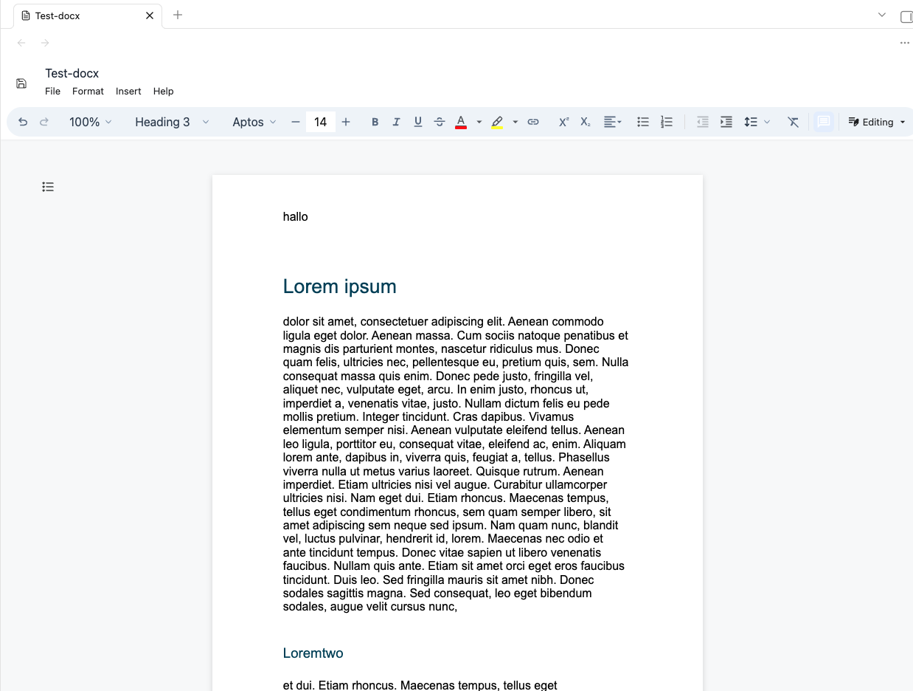

# Docxidian

docxidian opens `.docx` files directly inside Obsidian and saves edits back to the same vault file.
You can also embed (read-onlyx) docx-Files via ![[filename.docx]]

The editor integration is based on `@eigenpal/docx-editor-react`, adapted from its Vite/React usage pattern to Obsidian's plugin runtime:

- Obsidian loads the DOCX file with `vault.readBinary`.
- React renders `DocxEditor` only after the document buffer is available.
- Editor CSS is bundled as text and injected at runtime.
- The editor saves through its ref API and writes the resulting `ArrayBuffer` with `vault.modifyBinary`.

## Installation

This plugin is not yet part of the Obsidian community plugins. You can  install it via BRAT (just add the URL you're on right now as a beta plugin). You can also do it manually: Copy the files main.js and manifest.json from the release (look right) into the plugin folder of your vault.

## Usage

Enable the plugin in **Settings -> Community plugins**, then open a `.docx` file from the vault. Obsidian will route it to Docxidian's custom file view.

Use the editor toolbar's save action (upper left) or the command **Save current docx** to write changes back to the open file.

You can also embed (read-onlyx) docx-Files via ![[filename.docx]]

## Disclaimer

I vibecode my plugins—and the scope of this work exceeds my programming skills. Because of this, there is always a residual risk when using them. I do this primarily to bridge certain gaps in my own workflow. Should these plugins ever become obsolete because a professional developer used them as inspiration to code something truly solid and sophisticated, I would be absolutely thrilled.